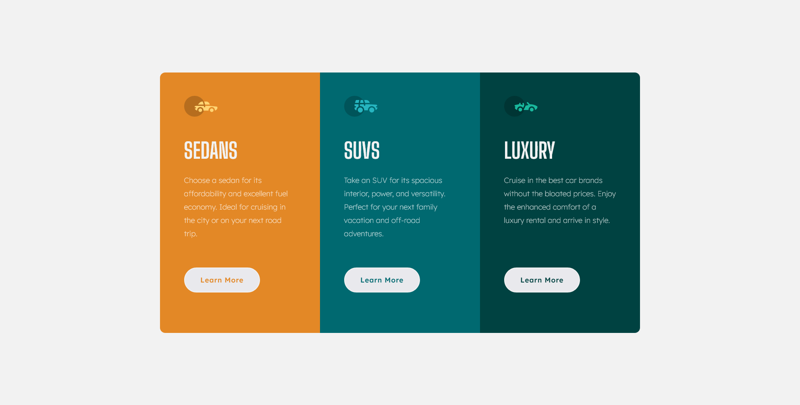

# Frontend Mentor - 3-column preview card component solution

This is a solution to the [3-column preview card component challenge on Frontend Mentor](https://www.frontendmentor.io/challenges/3column-preview-card-component-pH92eAR2-). Frontend Mentor challenges help you improve your coding skills by building realistic projects. 

## Table of contents

- [Overview](#overview)
  - [The challenge](#the-challenge)
  - [Screenshot](#screenshot)
- [My process](#my-process)
  - [What I learned](#what-i-learned)

## Overview

### The challenge

Users should be able to:

- View the optimal layout depending on their device's screen size
- See hover states for interactive elements

### Screenshot

### Links

- Solution URL: [Add solution URL here](https://your-solution-url.com)
- Live Site URL: [Add live site URL here](https://your-live-site-url.com)

## My process

### Built with

- Semantic HTML5 markup
- Sass
- Flexbox
- Mobile-first workflow

### What I learned

Previously as a beginner I did not pay attention to practice Mobile first approach to build web pages, Because I felt hard at the first place, but after giving it a try I realzed that it is the best approach, because it will easy to create responsive designs without worrying to much.

## Author

- Frontend Mentor - [iamdylanmj](https://www.frontendmentor.io/profile/iamdylanmj)
- Twitter - [iamdylanmj](https://twitter.com/DilanMa98729384)

